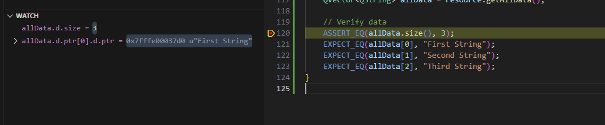

# Qt Threads Synchronization Library

A multi-threaded library demonstrating thread synchronization and shared resource management using Qt and Google Test.

## Project Overview

- **Language**: C++ with Qt 6
- **Testing Framework**: Google Test
- **Build System**: CMake
- **Development Environment**: VS Code with Dev Containers

## Features

- Thread-safe resource management
- Concurrent thread operations
- Comprehensive test suite
- Docker-based development environment

## Components

### SharedResource Class
- Thread-safe resource management
- Uses QMutex for synchronization
- Key methods:
  - `addData()`: Add data to the shared resource
  - `getAllData()`: Retrieve all stored data
  - `clear()`: Clear the resource
  - `size()`: Get current size

### ThreadWorker Class
- Manages concurrent thread operations
- Inherits from QObject
- Uses QThread for parallel execution
- Supports:
  - Starting/stopping threads
  - Work completion signaling
  - Thread synchronization

## Prerequisites

- Docker Desktop
- Visual Studio Code
- VS Code Extensions:
  - Remote - Containers
  - C/C++
  - CMake Tools

## Getting Started

1. Clone the repository:
   ```bash
   git clone <repository-url>
   cd Threads
   ```

2. Open in VS Code:
   ```bash
   code .
   ```

3. When prompted, click "Reopen in Container" or:
   - Press F1
   - Select "Remote-Containers: Reopen in Container"

4. Build the project:
   - Press Ctrl+Shift+P
   - Select "CMake: Configure"
   - Select "CMake: Build"

## Running Tests

### Using VS Code
1. Open the Testing view (flask icon in sidebar)
2. Click the play button to run all tests
3. Or run individual tests by clicking the play button next to each test

### Using Command Line
```bash
cd build
ctest --output-on-failure
```

## Debugging

### Setup
- Debugging configuration is provided in `.vscode/launch.json`
- GDB is configured with enhanced settings for better array and object visualization

## Debugging Guide

When debugging your tests or application, follow these steps:

1. Set a breakpoint in your code (F9 or click left of line number)
2. Start debugging (F5)
3. When the breakpoint is hit, use these methods to inspect data:

### Using Watch Window
1. Click the "+" in the Watch window
2. Add these expressions to watch Qt types:
```
# View entire QList/QVector
allData

# View specific QString elements (replace [0] with desired index)
allData.d.ptr[0].d.ptr
allData.d.ptr[1].d.ptr

# View container size
allData.d.size

# View raw data pointer
allData.d.ptr
```
### Watch Window Example


### Using Variables Panel
When viewing variables in the Variables panel:
1. Expand the `allData` variable
2. Look for `d.ptr` member
3. The `size` member shows container size
4. Cast individual elements using the Watch window expressions above

### Using Debug Console
```gdb
# View list/vector structure
-exec p allData

# View string at specific index
-exec p allData.d.ptr[0].d.ptr

# View multiple elements
-exec p allData.d.ptr[1].d.ptr
-exec p allData.d.ptr[2].d.ptr

# View size
-exec p allData.d.size

# View data pointer
-exec p allData.d.ptr
```

### Tips
- Add watch expressions without the `-exec p` prefix
- The strings are displayed in UTF-16 format (prefixed with 'u')
- Use array indexing [0], [1], etc. to access specific elements
- The `.d.ptr` member contains the actual string data
- Remember that array indices start at 0

## Project Structure

```
Threads/
├── .devcontainer/          # Dev container configuration
├── .vscode/               # VS Code settings
├── src/                   # Source files
│   ├── sharedresource.h
│   ├── sharedresource.cpp
│   ├── threadworker.h
│   └── threadworker.cpp
├── tests/                 # Test files
│   └── thread_test.cpp
└── CMakeLists.txt        # CMake configuration
```

## Development Notes

### Windows-Specific Configuration
- CMake is configured for Windows with Qt 6.6.1
- Uses MSVC compiler settings
- Exports all symbols for DLL creation

### Container Environment
- Based on Ubuntu 22.04
- Includes all necessary development tools
- Configured for Qt and C++ development
